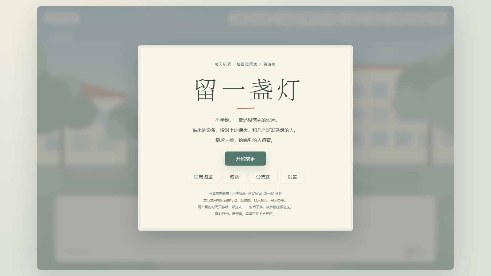
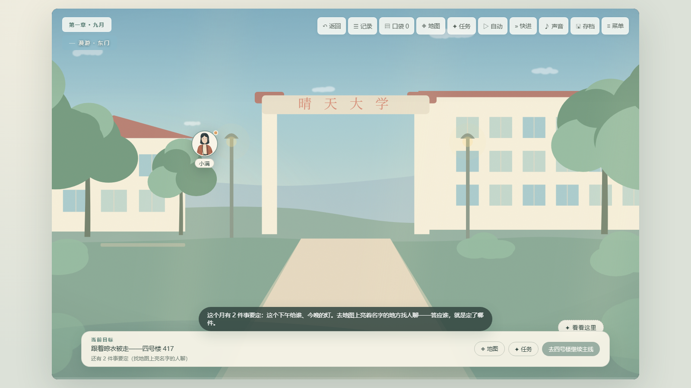
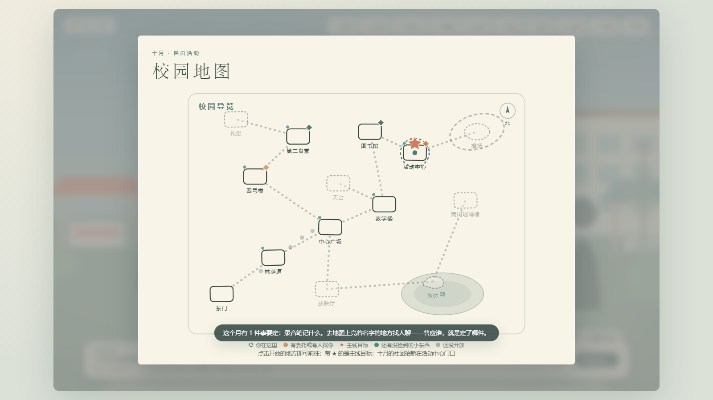
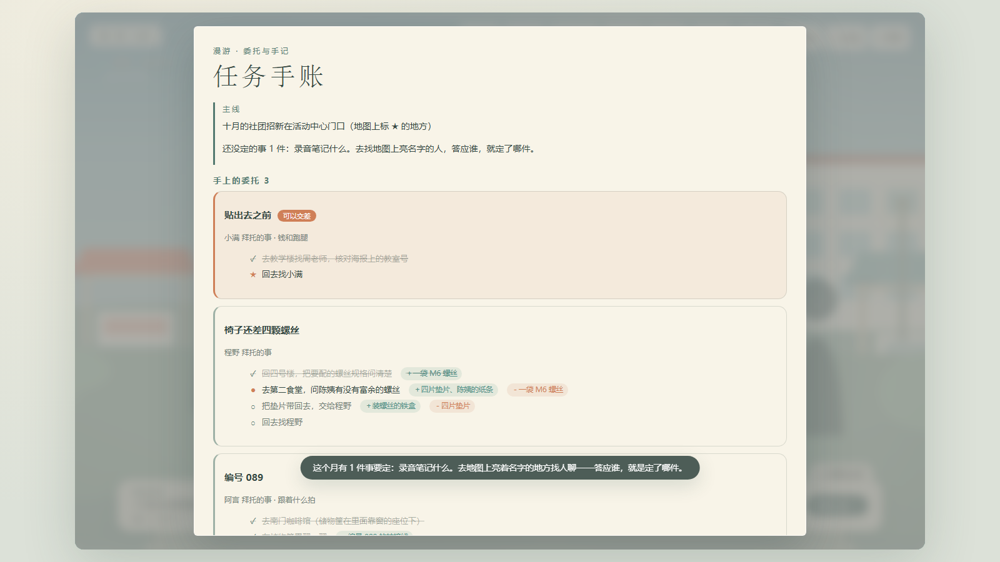
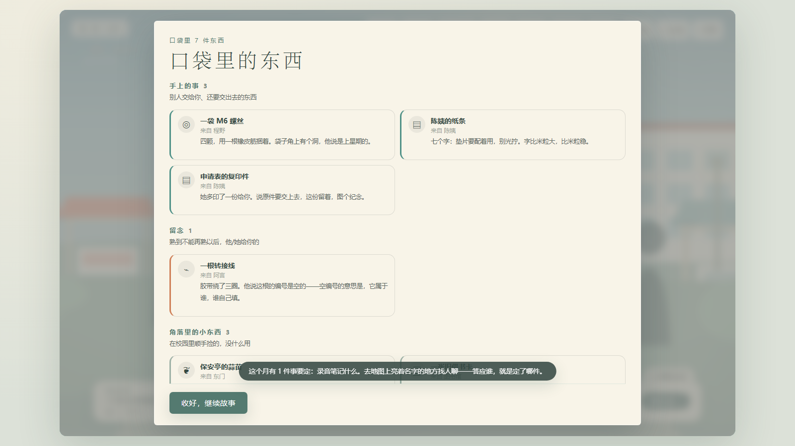

# 晴天以后 · 留一盏灯 · 漫游版

**After the Sunshine · 留一盏灯 · 漫游版**

一学期，一部还没剪完的短片，和几个慢慢熟悉的人。

单机校园群像视觉小说。在完整的五章剧本之上，加入了 **自由行动 / 可交互人物 / 校园地图 / 委托手账** 四层玩法。

主线里原来的 14 处「当场二选一」全部拆掉了——现在故事的走向不是当场点出来的，而是你在章节之间的空档里、把有限的时间花在谁身上换来的。28 条委托分成 10 个互斥组，接了组里的一件，同组其余几件这个月就作废。

纯前端实现：画面全部是程序化生成的 SVG，音乐与环境音由 WebAudio 实时合成，**没有一个外部资源、没有一次网络请求**。整个游戏就是一个可以双击打开的 HTML 文件。



注意:本作品由AI辅助完成。

---

## 直接玩

不想装任何东西的话，仓库里已经放好了成品：

| 方式 | 文件 | 说明 |
| --- | --- | --- |
| 浏览器 | [`成品/留一盏灯·漫游版（网页版）.html`](成品/留一盏灯·漫游版（网页版）.html) | 418 KB 单文件，双击即开 |
| 安卓手机 | [`成品/留一盏灯·漫游版.apk`](成品/留一盏灯·漫游版.apk) | 221 KB，Android 5.0+，锁横屏 |

> 电脑版是 282 MB 的免安装绿色版（单个 exe 就 190 MB，超过 GitHub 单文件上限，所以没进仓库）。
> 在本机跑 `node v4/tools/pack-desktop.mjs` 就能重新生成，存档跟着文件夹走。

> 网页版建议用 Chrome / Edge 打开。存档走浏览器的 localStorage，不会上传到任何地方。

安卓包是自签名的，首次安装系统会提示「未知来源」，允许即可，绝对无任何病毒。

---

## 玩法

**主线**：点一下补完文字，空格或 Enter 推进，返回按钮回退。
全篇五章、138 个剧情节点、**0 个当场选项**、14 处由世界状态决定的分岔、6 种结局。

**自由行动**：主线走到五个章节边界会进入漫游层（报到日 / 十月 / 十一月 / 十二月 / 一月）——

- **直接点画面上的人聊天。** 场景里的圆头像就是此刻在这里的人。首次见面有专门的打招呼，常聊天会提升熟络度（每人满 5 心）。
- **校园地图**（`M`）。14 处地点的手绘导览，虚线是道路，点哪里去哪里；橙点表示那里有委托找你，★ 是当前主线目的地，一撮小亮点表示那儿有个能顺手捡的东西。
- **任务手账**（`J`）。手上的委托、这个月没做的、听说的事、已完成、口袋速览、六个人的熟悉度。
- **口袋**（`▤`）。分三栏：手上的事 / 留念 / 角落里的小东西，外加一叠纸片。

**精力有限**。28 条委托分成 10 个互斥组，每组对应一处主线分岔。接了组里的一件，同组其余几件这个月就作废（手账里标成「这个月没空」，并且不会再出现）。这一版想说的不是"全都做一遍"，而是"你只能选"：

| 窗口 | 互斥组 | 决定的主线走向 |
| --- | --- | --- |
| 报到日 | 这个下午给谁 | 拍空间 / 拍人 |
| 报到日 | 今晚的灯 | 借灯 / 不借 |
| 十月 | 跟着什么拍 | 拍人 / 拍地方 |
| 十月 | 钱和跑腿 | 小预算 / 一起垫 |
| 十月 | 录音笔记什么 | 只录环境声 / 先审一遍 |
| 十一月 | 片子怎么改 | 先撤下来 / 约人对表 |
| 十一月 | 六块钱和排班 | 排班还 / 各自分担 |
| 十二月 | 在哪儿放 | 走官方流程 / 借小教室 |
| 十二月 | 今晚停不停 | 停 / 搬去自习室 |
| 一月 | 放完以后 | 公开 / 只办一场 / 留给下一届 |

**道具真的在手上走**。别人递过来的东西会收进口袋（飞进口袋按钮），交差时再给出去（飞向对话人）。有两条链跨了好几个人甚至好几个月：

- 程野 → 陈姨 → 程野：一袋 M6 螺丝 → 换回四片垫片和一张纸条 → 垫片交回，换回装螺丝的旧铁盒。
- 陈姨 → 阿言 → 陈姨（五步）：手写草稿 → 交给阿言调格式 → 回食堂取两寸照片 → 照片交回阿言 → 打印好交回陈姨 → 留下一份复印件。
- 跨委托：十月「编号 089」拿到的一卷编号胶带，十二月「一柜子的线」才用得上；十二月那份复印件，一月才归进阿言的交接文件夹。没拿到前一件，后一件就是 `locked`。

**满 5 心以后再去说一次话**，会触发一段只属于你们两个人的对话，然后拿到这个人的专属留念物（每人一件，只给一次）：小满的空杯子照片、程野的蓝色手柄螺丝刀、阿言的转接线、陈姨写着「耳东陈」的纸条、周老师翻旧的讲义、妈妈那张蒸蛋配方的短信截图。妈妈每个窗口都会打电话来（在四号楼接）；周老师十月起在教学楼，一月在礼堂——想拿这两件留念物，一次都别落下。

**口袋里还有彩蛋**。14 处地点各藏一件校园小物，点「✦ 看看这里」就会顺手收进袋子——保安亭的蒜苗、压平的梧桐叶、盖满十个章没人来换的积点卡、1998 年的旧借书卡……每件配一段正经里带点毛病的说明，没有任务用途，纯收集。

| 漫游 | 地图 | 手账 | 口袋 |
| --- | --- | --- | --- |
|  |  |  |  |

---

## 文本分成三种声音

这是本项目里最花心思的一块。对白、旁白、心声在**数据与渲染上都分开处理**，不是靠一个 CSS 类糊上去的。

**写作侧**用四个构造器：

```js
D('你也是新生？')            // 对白
N('她点头，动作很快。')       // 旁白
I('轮子还在，只是决定横着走。') // 心声
S('小满', '又是你啊。')       // 旁白里提到某人，带上说话人色相
```

**兜底**：老写法（一整段纯文本）照样能用。`bare(text, who)` 会扫描中文引号 `“ ” 「 」` 的嵌套深度，自动把它切成旁白 / 对白——所以漏写分段也不会露馅。

**双轨产出**：`beat()` 一次生成两份东西——`node.seg`（带 kind 的段数组，给渲染用）和 `node.text`（扁平字符串，给故事记录、导出、旧存档用）。`tools/validate-story.mjs` 里加了永久断言，两者一旦漂移就直接报错。

**渲染**：`engine.setText(segs)` 为每一段建一个 `<span class="seg seg-{k}">`，打字机按「整串偏移」灌字，逐段显示不会串行。

**视觉**走三个互不干扰的通道——明度（旁白压到 72%）、字重（对白 600）、字体（心声走衬线），六位常出场人物再叠一层 `[data-who]` 色相偏移。全部用 `color-mix()` 写，切到夜读界面自动跟着变。

当前剧本共 **657 段**——旁白 339、对白 139、心声 179，正文约 10,000 字，137 个含正文的节点里有 127 个同时用了两种以上声音。

---

## 项目结构

```
index.html          入口（加载 5 CSS + 14 JS）
css/                tokens · scenes · ui · edition（纸墨主题）· game（漫游层）
js/                 story(138 节点 · 无选项 · 分段) · engine · ui · stage · art · palette
                    character · audio · storage
                    quests(物品/互斥组/委托/手记/留念) · game(世界规则) · roam(漫游呈现)
tools/              build · check-api · check-css · check-shots · validate-story
                    inspect-art · probe · probe-roam · shots · peek
                    make-icons.py · pack-desktop · pack-android · verify-all
_backup/            每次大改前的 story / game / roam / ui / engine 存档
```

`js/` 全部挂在 `window.SP` 命名空间下，IIFE 封装，加载顺序
`util → palette → art → character → audio → stage → story → storage → quests → game → roam → ui → engine → main`。

---

## 自检

项目自带一套可复现的校验，**十步全绿**：

```bash
cd v4
node tools/verify-all.mjs --shots
```

1. **语法** — 14 个 JS 模块 `node --check`
2. **API 一致性** — 所有 `SP.ns.member` 调用都对得上导出（识别 4 种导出写法）
3. **剧情图** — 138 节点可达、6 结局可达、无断链 / 孤儿 / 非法取值，并断言分段与扁平文本一致
4. **美术结构** — 14 个场景的四层 SVG 合法
5. **单文件打包** — 无外链、无外部请求
6. **CSS 压缩等价性** — 让 Chrome 分别解析压缩版与原样版样式表，逐条规则比对
7. **运行时探针** — 33 项（封面、推进、存读档、结局、面板，以及 1536 组 flag 取样下 14 处函数式分岔全部落到真实节点）
8. **漫游玩法探针** — 47 项（闸门进入 → 看一看 → 地图旅行 → 三次对话走完「答应 / 办事 / 交差」→ 互斥作废 → 道具链三步取交 → 好感满值留念物 → 手账作废栏 → 口袋三层 → 「还有事没定」确认 → 回主线 → 存档含 world）
9. **预览截图** — 19 张
10. **截图体检** — 逐像素解码，检查尺寸 / 亮度 / 主色

第 6 步值得多说一句：打包器的 CSS 压缩器曾经有过一个静默破坏样式的 bug——连 `.j-face .dots` 这种后代选择器都会被压成非法规则，一共丢了 222 条声明，而且产物还能正常打开、只是样子悄悄变了。`tools/check-css.mjs` 就是为了抓它而写的，并且已经回归验证过它确实能抓住。

---

## 打包

两条链都不依赖 Gradle / Android Studio / electron-builder，只用系统里现成的东西。

```bash
cd v4
node tools/pack-desktop.mjs   # 电脑版 → ../成品/留一盏灯·漫游版（电脑版）/
node tools/pack-android.mjs   # 安卓版 → ../成品/留一盏灯·漫游版.apk
```

- **电脑版**：Electron 便携版。换名的 `electron.exe` + `resources/app/`，用 `app.setPath('userData', exe 旁的「存档与设置」)` 让存档跟着包走；F11 全屏、单实例锁、后台不节流。图标与版本资源用 `rcedit` 刷进 exe。
- **安卓版**：`aapt2 compile` → `aapt2 link -A assets` → `javac -source 8 -target 8 -bootclasspath android.jar` → `d8` → 追加 `classes.dex` → `zipalign -p 4` → `apksigner` 自签 v1+v2+v3。外壳是一个 WebView Activity，用 `loadDataWithBaseURL("https://lamp.local/", …)` 的虚拟源保证 localStorage 一定落盘，返回键翻译成游戏自己的收口动作。

两个脚本开头都有一段 **新鲜度闸门**：先比 `index.html` / `js/` / `css/` 与 `dist/` 产物的 mtime，源码更新就自动重建。加上它是因为真踩过坑——有一版 `roam.js` 改完忘了重新构建，打包器安静地吃了一份过期产物，打出来的包里缺两个导出函数，全程不报任何错。

---

## 已知限制

- 存档 key 前缀是 `sp4:`，与早期版本互不覆盖。
- 电脑版首次在部分老显卡机器上可能需要加 `--disable-gpu` 启动（走软件渲染）。
- 自检覆盖的是 DOM 自动化与渲染层面；音频听感、长局存档轮换这类事情仍建议人工过一遍。

## 许可

个人作品，请勿商用。剧本、角色与美术均为原创。
